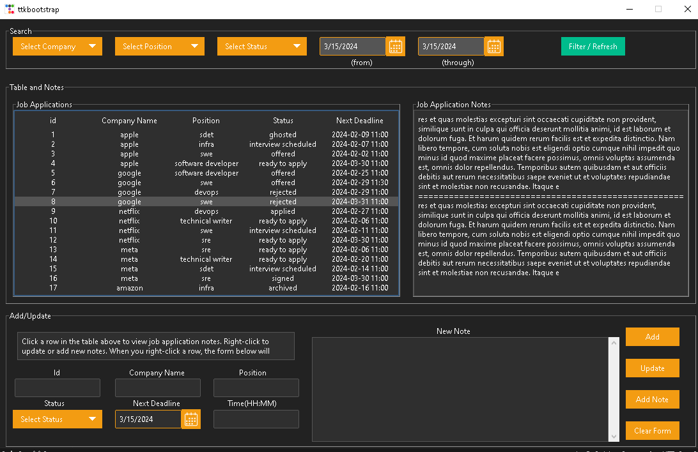

# JobApplicationTracker

This application was developed to assist in managing past, current, and future job applications. It enables users to add new job applications, update existing ones, and add notes for reference.

<!--  -->


## Features
* **Add New Applications**: Easily input details for new job applications.
* **Update Existing Applications**: Update information for existing job applications.
* **Note Taking**: Add notes to each job application for future reference.

## Usage
1. Install dependencies, after creating a virtual environment:

    ```bash
    pip install ttkbootstrap
    ```

2. Run the application:

    ```bash
    python3 jobapplicationtracker.py
    ```

3. Use the interface to add, update, and manage job applications.

4.  There is a file called ```datagen.py``` which initializes the database and can also generate random data for testing purposes.

## Feedback and Contributions
Your feedback and contributions are highly appreciated! Please feel free to submit any suggestions or pull requests to help improve this project.


## Credit
[ttkbootstrap](https://github.com/israel-dryer/ttkbootstrap) - Bootstrap-inspired theme for Tkinter.